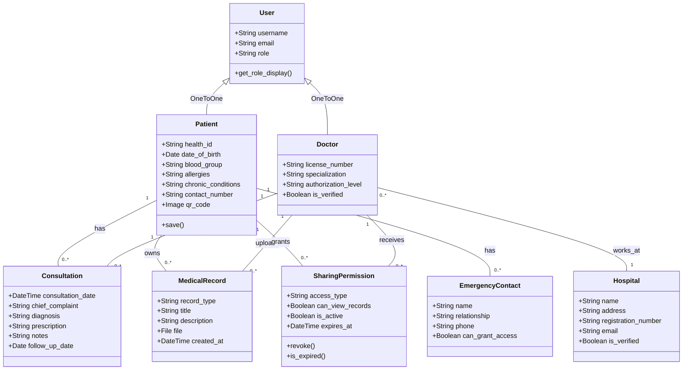
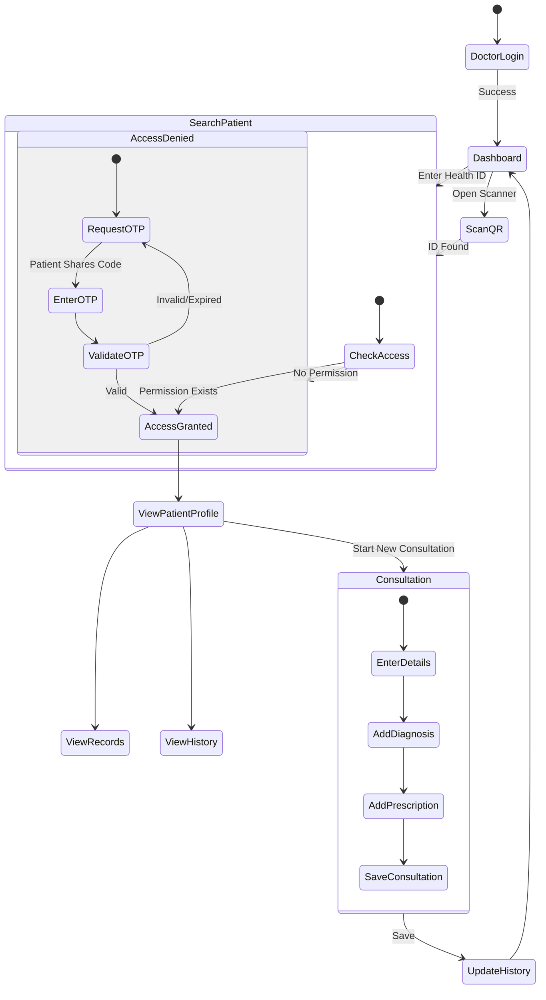
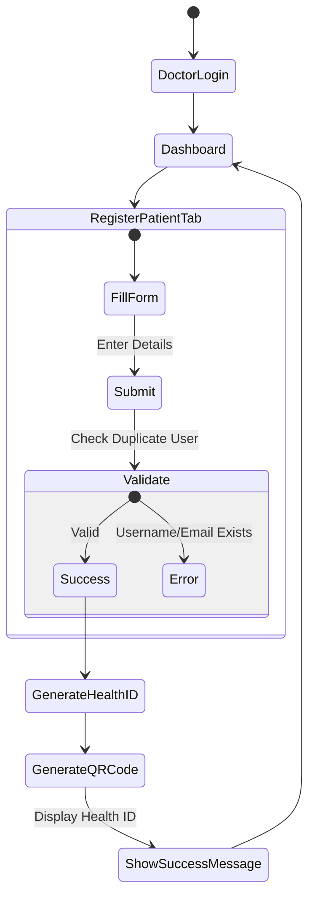
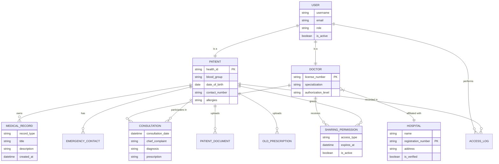

# Project Diagrams

## Class Diagram

```mermaid
classDiagram
    class User {
        +String username
        +String email
        +String role
        +get_role_display()
    }

    class Patient {
        +String health_id
        +Date date_of_birth
        +String blood_group
        +String allergies
        +String chronic_conditions
        +String contact_number
        +Image qr_code
        +save()
    }

    class Doctor {
        +String license_number
        +String specialization
        +String authorization_level
        +Boolean is_verified
    }

    class Hospital {
        +String name
        +String address
        +String registration_number
        +String email
        +Boolean is_verified
    }

    class Consultation {
        +DateTime consultation_date
        +String chief_complaint
        +String diagnosis
        +String prescription
        +String notes
        +Date follow_up_date
    }

    class MedicalRecord {
        +String record_type
        +String title
        +String description
        +File file
        +DateTime created_at
    }

    class SharingPermission {
        +String access_type
        +Boolean can_view_records
        +Boolean is_active
        +DateTime expires_at
        +revoke()
        +is_expired()
    }

    class EmergencyContact {
        +String name
        +String relationship
        +String phone
        +Boolean can_grant_access
    }

    User <|-- Patient : OneToOne
    User <|-- Doctor : OneToOne
    Doctor "0..*" -- "1" Hospital : works_at
    Patient "1" -- "0..*" Consultation : has
    Doctor "1" -- "0..*" Consultation : performs
    Patient "1" -- "0..*" MedicalRecord : owns
    Doctor "1" -- "0..*" MedicalRecord : uploads
    Patient "1" -- "0..*" SharingPermission : grants
    Doctor "1" -- "0..*" SharingPermission : receives
    Patient "1" -- "0..*" EmergencyContact : has
```

## Activity Diagram: Doctor Consultation Flow

```mermaid
stateDiagram-v2
    [*] --> DoctorLogin
    DoctorLogin --> Dashboard : Success
    Dashboard --> SearchPatient : Enter Health ID
    Dashboard --> ScanQR : Open Scanner
    
    ScanQR --> SearchPatient : ID Found
    
    state SearchPatient {
        [*] --> CheckAccess
        CheckAccess --> AccessGranted : Permission Exists
        CheckAccess --> AccessDenied : No Permission
        
        state AccessDenied {
            [*] --> RequestOTP
            RequestOTP --> EnterOTP : Patient Shares Code
            EnterOTP --> ValidateOTP
            ValidateOTP --> AccessGranted : Valid
            ValidateOTP --> RequestOTP : Invalid/Expired
        }
    }
    
    AccessGranted --> ViewPatientProfile
    ViewPatientProfile --> ViewRecords
    ViewPatientProfile --> ViewHistory
    
    state Consultation {
        [*] --> EnterDetails
        EnterDetails --> AddDiagnosis
        AddDiagnosis --> AddPrescription
        AddPrescription --> SaveConsultation
    }
    
    ViewPatientProfile --> Consultation : Start New Consultation
    Consultation --> UpdateHistory : Save
    UpdateHistory --> Dashboard
```

## Activity Diagram: Patient Registration

```mermaid
stateDiagram-v2
    [*] --> DoctorLogin
    DoctorLogin --> Dashboard
    Dashboard --> RegisterPatientTab
    
    state RegisterPatientTab {
        [*] --> FillForm
        FillForm --> Submit : Enter Details
        Submit --> Validate : Check Duplicate User
        
        state Validate {
            [*] --> Success : Valid
            [*] --> Error : Username/Email Exists
        }
    }
    
    Success --> GenerateHealthID
    GenerateHealthID --> GenerateQRCode
    GenerateQRCode --> ShowSuccessMessage : Display Health ID
    ShowSuccessMessage --> Dashboard
```

## ER Diagram

```mermaid
erDiagram
    USER ||--|| PATIENT : "is a"
    USER ||--|| DOCTOR : "is a"
    
    DOCTOR }|--|| HOSPITAL : "affiliated with"
    
    PATIENT ||--o{ CONSULTATION : "participates in"
    DOCTOR ||--o{ CONSULTATION : "conducts"
    
    PATIENT ||--o{ MEDICAL_RECORD : "owns"
    
    PATIENT ||--o{ SHARING_PERMISSION : "grants"
    DOCTOR ||--o{ SHARING_PERMISSION : "receives"
    
    PATIENT ||--o{ EMERGENCY_CONTACT : "has"
    
    PATIENT ||--o{ PATIENT_DOCUMENT : "uploads"
    PATIENT ||--o{ OLD_PRESCRIPTION : "uploads"
    
    PATIENT ||--o{ ACCESS_LOG : "recorded in"
    USER ||--o{ ACCESS_LOG : "performs"
    
    USER {
        string username
        string email
        string role
        boolean is_active
    }

    PATIENT {
        string health_id PK
        string blood_group
        date date_of_birth
        string contact_number
        string allergies
    }

    DOCTOR {
        string license_number PK
        string specialization
        string authorization_level
    }

    HOSPITAL {
        string name
        string registration_number PK
        string address
        boolean is_verified
    }

    CONSULTATION {
        datetime consultation_date
        string chief_complaint
        string diagnosis
        string prescription
    }

    MEDICAL_RECORD {
        string record_type
        string title
        string description
        datetime created_at
    }

    SHARING_PERMISSION {
        string access_type
        datetime expires_at
        boolean is_active
    }
```
